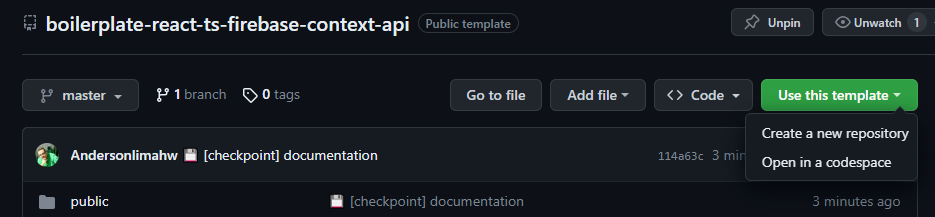
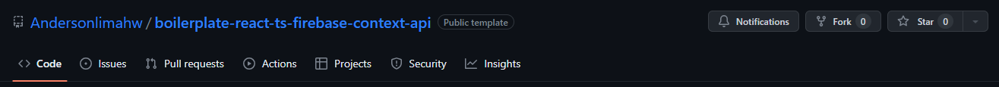
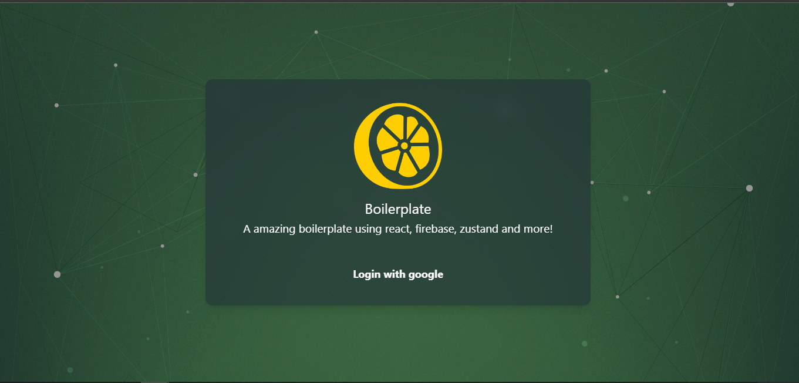

<h1 align="center">React TestForge — Vitest + Playwright Starter</h1>
<p>
  

  <a href="#" target="_blank">
    
  </a>

  <a href="https://twitter.com/anderson.lima.dev" target="_blank">
    
  </a>

  <br />
  
 
 
 

 
 
 

> A production-minded React testing starter with Vite, TypeScript, Vitest, Testing Library and Playwright.


### ✨ [Demo](https://lemon-firebase-chat-sample.vercel.app)

See a project using this starter.

## Why TestForge?

TestForge gives a React team a focused quality baseline instead of another empty Vite screen. Start with unit, component and end-to-end testing patterns, then adapt the app to your product without hiding the test runner or the data layer behind magic.

The repository is public for learning and experimentation. It does not currently declare an SPDX license; review the repository terms before using it in a commercial product.

## Using

Use has template




Or fork:



Customize pages how you need!

## ✨ Features ✨

* Created using vite a very fast front-end tooling

* Toasts with  react-tostify

* zustand for global state management
* React query for request state management

* Base service to manage your requests
* Mocks with miragejs
* Vitest and Testing Library for unit and component tests with coverage
* Playwright for E2E testing with multi-browser support
* Comprehensive testing suite (unit, component, and E2E tests)
* PWA support with offline capabilities
* TypeScript support for type safety
* Tailwind CSS for styling
* Comprehensive documentation in `/src/docs`


## Boilerplates
Boilerplates are pre-made templates or frameworks that contain a foundational structure, configurations, and often basic functionalities for a particular type of project. They're designed to help kick-start development by providing a starting point, allowing developers to avoid repetitive setup tasks and focus on building specific features.

You can get more boilerplates in this github profile:
[click here for more boilerplates 👩🏾‍🎤](https://github.com/Andersonlimahw?tab=repositories&q=boiler&type=&language=&sort=)

## Install

```sh
npm install
```

## Run

```sh
npm run dev

```

Open link in your favorite your browser:
[http://localhost:5173](http://localhost:5173/)




## Testing

### Unit Tests

Run unit tests with Vitest:
```sh
npm run test
```

Run tests with coverage:
```sh
npm run test:coverage
```

### E2E Tests

Run E2E tests with Playwright:
```sh
# Run all E2E tests
npm run test:e2e

# Run E2E tests with UI mode
npm run test:e2e:ui

# Run E2E tests in headed mode (see browser)
npm run test:e2e:headed

# Run E2E tests in debug mode
npm run test:e2e:debug

# Run tests on specific browsers
npm run test:e2e:chromium
npm run test:e2e:firefox
npm run test:e2e:webkit

# Run tests on mobile viewports
npm run test:e2e:mobile

# View test report
npm run test:e2e:report
```

### Install Playwright browsers

```sh
npm run playwright:install
```

### Test Coverage

The project includes comprehensive test coverage including:
- **Unit tests** for components and utilities
- **Component tests** with React Testing Library
- **E2E tests** covering critical user flows:
  - Login and authentication
  - Chat functionality
  - Profile management
  - Settings page
  - Navigation flows
  - API feedback states
  - Community features
  - Groups management

For more details, see the [Testing Documentation](./src/docs/testing.md) and [E2E Documentation](./docs/e2e/index.md)

## Technologies and strategies:

### Core Technologies
[vite](https://vitejs.dev/) - Fast front-end tooling <br />
[react](https://react.dev/learn) - UI library <br />
[typescript](https://www.typescriptlang.org/docs/) - Type safety <br />
[pwa](https://developer.mozilla.org/en-US/docs/Web/Progressive_web_apps) - Progressive Web App support <br />

### State Management & Data Fetching
[zustand](https://github.com/pmndrs/zustand) - Global state management <br />
[react-query](https://tanstack.com/query/latest/docs/framework/react/overview) - Server state management <br />

### Styling
[tailwindcss](https://tailwindcss.com/docs/animation) - Utility-first CSS framework <br />

### Testing
[vitest](https://vitest.dev/) - Unit testing framework <br />
[playwright](https://playwright.dev/) - E2E testing framework <br />
[@testing-library/react](https://testing-library.com/docs/react-testing-library/intro/) - React component testing <br />
[miragejs](https://miragejs.com/) - API mocking <br />

### Additional Tools
[firebase](https://firebase.google.com/docs) - Backend services <br />
[radix-ui](https://www.radix-ui.com/) - Accessible UI components <br />

## Documentation

Comprehensive documentation is available in the `/src/docs` directory:

- [Getting Started](./src/docs/getting-started.md) - Quick start guide
- [Project Structure](./src/docs/project-structure.md) - Codebase organization
- [Testing Guide](./src/docs/testing.md) - Testing strategies and examples
- [API Integration](./src/docs/api-integration.md) - API setup and usage
- [State Management](./src/docs/state-management.md) - Zustand and React Query usage
- [Styling Guide](./src/docs/styling-guide.md) - Tailwind CSS best practices
- [Deployment](./src/docs/deployment.md) - Deployment strategies
- [E2E Testing Specs](./docs/e2e/index.md) - BDD specifications for E2E tests

## Project Structure

```
boilerplate-reactjs-testes/
├── e2e/                        # E2E tests with Playwright
│   └── tests/                  # E2E test files
│       ├── login.spec.ts
│       ├── chat.spec.ts
│       ├── profile.spec.ts
│       ├── settings.spec.ts
│       ├── navigation.spec.ts
│       ├── community.spec.ts
│       ├── groups.spec.ts
│       └── api-feedback.spec.ts
├── src/
│   ├── commons/                # Shared components and utilities
│   │   └── components/         # Reusable components
│   ├── pages/                  # Page components
│   │   ├── Chat/
│   │   ├── Community/
│   │   ├── Groups/
│   │   ├── Profile/
│   │   └── Settings/
│   ├── docs/                   # Project documentation
│   └── mocks/                  # API mocks with MirageJS
├── playwright.config.ts        # Playwright configuration
├── vite.config.js              # Vite and Vitest configuration
└── vitest.setup.ts             # Vitest setup file
```

## Browser Support

The E2E tests are configured to run on:
- **Desktop**: Chrome, Firefox, Safari (WebKit)
- **Mobile**: Chrome (Pixel 5), Safari (iPhone 12)

## CI/CD Ready

The testing setup is optimized for CI/CD environments:
- Configurable retry logic for flaky tests
- HTML and JSON reporters for test results
- Screenshots and videos on test failure
- Parallel test execution support
- Coverage reporting

## Author

👤 **Anderson Lima (Lemon 🍋)**

- Website: https://lemon.dev.br
- Twitter: [@andersonlimahw](https://twitter.com/andersonlimahw)
- Github: [@andersonlimahw](https://github.com/andersonlimahw)
- LinkedIn: [@andersonlimahw](https://linkedin.com/in/andersonlimahw)

## ⭐ Show your support
give a ⭐ if this project helped you!
